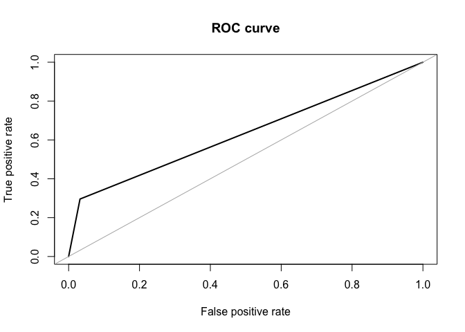
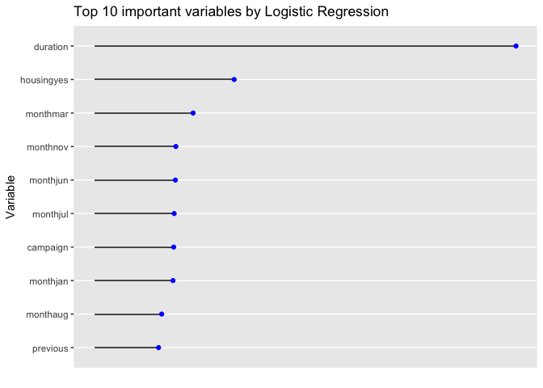

Identification of marketing attributes : Portugese Bank
================

Abstract
--------

Aim of the project is to identify the main attributes to increase the efficiency of the Marketing Strategy of the Bank , whether a customer would subscribe a 'Term - Deposit'

Introduction
------------

Telemarketing strategy are very economical and viable , but without knowing the customer's whom we are marketting too, we are wasting a lot of resources and time.In order to save costs and time, it is important to filter the contacts but keep a certain success rate.

Objective
---------

Our objective is to build classification models, from which we can identify the important attributes of those customers who do subscribe to the 'Term - Deposit' products, thereby implementing targeted telemarketing.

Dataset Description
-------------------

The dataset is taken from [UCI MACHINE LEARNING REPOSITORY](https://archive.ics.uci.edu/ml/datasets/bank+marketing).
The dataset has 45211 records spread across 17 variables. A brief description of the variables is as below:

    ## [1] 45211    17

The column names/descriptor attributes along with their structure are as below:

    ##  [1] "age"       "job"       "marital"   "education" "default"  
    ##  [6] "balance"   "housing"   "loan"      "contact"   "day"      
    ## [11] "month"     "duration"  "campaign"  "pdays"     "previous" 
    ## [16] "poutcome"  "y"

    ## 'data.frame':    45211 obs. of  17 variables:
    ##  $ age      : int  58 44 33 47 33 35 28 42 58 43 ...
    ##  $ job      : Factor w/ 12 levels "admin.","blue-collar",..: 5 10 3 2 12 5 5 3 6 10 ...
    ##  $ marital  : Factor w/ 3 levels "divorced","married",..: 2 3 2 2 3 2 3 1 2 3 ...
    ##  $ education: Factor w/ 4 levels "primary","secondary",..: 3 2 2 4 4 3 3 3 1 2 ...
    ##  $ default  : Factor w/ 2 levels "no","yes": 1 1 1 1 1 1 1 2 1 1 ...
    ##  $ balance  : int  2143 29 2 1506 1 231 447 2 121 593 ...
    ##  $ housing  : Factor w/ 2 levels "no","yes": 2 2 2 2 1 2 2 2 2 2 ...
    ##  $ loan     : Factor w/ 2 levels "no","yes": 1 1 2 1 1 1 2 1 1 1 ...
    ##  $ contact  : Factor w/ 3 levels "cellular","telephone",..: 3 3 3 3 3 3 3 3 3 3 ...
    ##  $ day      : int  5 5 5 5 5 5 5 5 5 5 ...
    ##  $ month    : Factor w/ 12 levels "apr","aug","dec",..: 9 9 9 9 9 9 9 9 9 9 ...
    ##  $ duration : int  261 151 76 92 198 139 217 380 50 55 ...
    ##  $ campaign : int  1 1 1 1 1 1 1 1 1 1 ...
    ##  $ pdays    : int  -1 -1 -1 -1 -1 -1 -1 -1 -1 -1 ...
    ##  $ previous : int  0 0 0 0 0 0 0 0 0 0 ...
    ##  $ poutcome : Factor w/ 4 levels "failure","other",..: 4 4 4 4 4 4 4 4 4 4 ...
    ##  $ y        : Factor w/ 2 levels "no","yes": 1 1 1 1 1 1 1 1 1 1 ...

**Description of dataset attributes**

1.  age (numeric)
2.  job : type of job (categorical: 'admin.','blue-collar','entrepreneur','housemaid','management','retired','self-employed','services','student','technician','unemployed','unknown')
3.  marital : marital status (categorical: 'divorced','married','single','unknown'; note: 'divorced' means divorced or widowed) 4 . education (categorical: 'basic.4y','basic.6y','basic.9y','high.school','illiterate','professional.course','university.degree','unknown')
4.  default: has credit in default? (categorical: 'no','yes','unknown')
5.  balance : representing balance held by customer under various accounts in that bank.
6.  housing: has housing loan? (categorical: 'no','yes','unknown')
7.  loan: has personal loan? (categorical: 'no','yes','unknown') 9 . contact: contact communication type (categorical: 'cellular','telephone')
8.  month: last contact month of year (categorical: 'jan', 'feb', 'mar', ..., 'nov', 'dec')
9.  day\_of\_week: last contact day of the week (categorical: 'mon','tue','wed','thu','fri')
10. duration: last contact duration, in seconds (numeric) 13 - campaign: number of contacts performed during this campaign and for this client (numeric, includes last contact) 14 - pdays: number of days that passed by after the client was last contacted from a previous campaign (numeric; 999 means client was not previously contacted) 15 - previous: number of contacts performed before this campaign and for this client (numeric) 16 - poutcome: outcome of the previous marketing campaign (categorical: 'failure','nonexistent','success') 17- y - has the client subscribed a term deposit? (binary: 'yes','no')

*Important note* *The duration attribute highly affects the output target (e.g., if duration=0 then y='no').Yet, the duration is not known before a call is performed.Also, after the end of the call y is obviously known.Thus, this input should only be included for benchmark purposes and should be discarded if the intention is to have a realistic predictive model.*

The dataset is checked if any 'NA's' exists and the top rows of the dataset are below:

    ## [1] FALSE

    ##   age          job marital education default balance housing loan contact
    ## 1  58   management married  tertiary      no    2143     yes   no unknown
    ## 2  44   technician  single secondary      no      29     yes   no unknown
    ## 3  33 entrepreneur married secondary      no       2     yes  yes unknown
    ## 4  47  blue-collar married   unknown      no    1506     yes   no unknown
    ## 5  33      unknown  single   unknown      no       1      no   no unknown
    ## 6  35   management married  tertiary      no     231     yes   no unknown
    ##   day month duration campaign pdays previous poutcome  y
    ## 1   5   may      261        1    -1        0  unknown no
    ## 2   5   may      151        1    -1        0  unknown no
    ## 3   5   may       76        1    -1        0  unknown no
    ## 4   5   may       92        1    -1        0  unknown no
    ## 5   5   may      198        1    -1        0  unknown no
    ## 6   5   may      139        1    -1        0  unknown no

We also wanna check how many 'unknown's' if any exist under each column.

    ##       age                 job           marital          education    
    ##  Min.   :18.00   blue-collar:9732   divorced: 5207   primary  : 6851  
    ##  1st Qu.:33.00   management :9458   married :27214   secondary:23202  
    ##  Median :39.00   technician :7597   single  :12790   tertiary :13301  
    ##  Mean   :40.94   admin.     :5171                    unknown  : 1857  
    ##  3rd Qu.:48.00   services   :4154                                     
    ##  Max.   :95.00   retired    :2264                                     
    ##                  (Other)    :6835                                     
    ##  default        balance       housing      loan            contact     
    ##  no :44396   Min.   : -8019   no :20081   no :37967   cellular :29285  
    ##  yes:  815   1st Qu.:    72   yes:25130   yes: 7244   telephone: 2906  
    ##              Median :   448                           unknown  :13020  
    ##              Mean   :  1362                                            
    ##              3rd Qu.:  1428                                            
    ##              Max.   :102127                                            
    ##                                                                        
    ##       day            month          duration         campaign     
    ##  Min.   : 1.00   may    :13766   Min.   :   0.0   Min.   : 1.000  
    ##  1st Qu.: 8.00   jul    : 6895   1st Qu.: 103.0   1st Qu.: 1.000  
    ##  Median :16.00   aug    : 6247   Median : 180.0   Median : 2.000  
    ##  Mean   :15.81   jun    : 5341   Mean   : 258.2   Mean   : 2.764  
    ##  3rd Qu.:21.00   nov    : 3970   3rd Qu.: 319.0   3rd Qu.: 3.000  
    ##  Max.   :31.00   apr    : 2932   Max.   :4918.0   Max.   :63.000  
    ##                  (Other): 6060                                    
    ##      pdays          previous           poutcome       y        
    ##  Min.   : -1.0   Min.   :  0.0000   failure: 4901   no :39922  
    ##  1st Qu.: -1.0   1st Qu.:  0.0000   other  : 1840   yes: 5289  
    ##  Median : -1.0   Median :  0.0000   success: 1511              
    ##  Mean   : 40.2   Mean   :  0.5803   unknown:36959              
    ##  3rd Qu.: -1.0   3rd Qu.:  0.0000                              
    ##  Max.   :871.0   Max.   :275.0000                              
    ## 

We can notice that 2 columns `education` and `poutcome(determining the outcome of previous marketing campaign)` have a considerable number of unknown's + Under Education we have:

    ## # A tibble: 2 x 2
    ##        y Number_of_Unkowns
    ##   <fctr>             <int>
    ## 1     no              1605
    ## 2    yes               252

THe percentage of unknown's being 4.1074075

-   Under Poutcome we have:

<!-- -->

    ## # A tibble: 2 x 2
    ##        y Number_of_Unkowns
    ##   <fctr>             <int>
    ## 1     no             33573
    ## 2    yes              3386

The percentage of unknown's being 81.7478047

### How do we deal with 'unknown' data?

The existence of 'unknown's' can blur any patterns held by dataset , thereby making it difficult to extract information.

We can deal with unknown data in the below ways : + Imputation : This method involved replacing the missing values, with estimates. + Deletion : We remove the unknow value rows from the dataset.

We first carry out the `Chi-Square Test of Independence`, to determine if the columns 'education' and 'poutcome' have stastically significant relationship. A chi-square statistic for two-way tables is sensitive to the strength of the observed relationship. The stronger the relationship, the larger the value of the chi-square test. A p -value for a chi-square statistic is the probability that the chi-square value would be as large as it is (or larger) if really there were no relationship between the variables.

**Decision rule : An observed relationship will be called statistically significant when the p-value for a chi-square test is less than 0.05.**

`{ r echo =FALSE} Education_tbl <- table(bank$education,bank$y) Education_tbl chisq_education <- chisq.test(Education_tbl) chi_edn <- chisq_education$p.value` The chi-square stastic between the columns education and y is 1.626656e-51 , it is lesser than 0.05. Indicating, the unknown's are stastically significant.

    ##          
    ##              no   yes
    ##   failure  4283   618
    ##   other    1533   307
    ##   success   533   978
    ##   unknown 33573  3386

The chi-square stastic between the columns poutcome and y is 0 , it is lesser than 0.05. Indicating, the unknown's are stastically significant.

*Decision with respect to Unknown* We know that the education column has 4.1074075% unknown's, we remove those columns from the dataset. The Poutcome columns represents the results of the previous marketing campaign and has 81.7478047%. As this columns doesnt really help in identification of attributes for our future marketing campaign. We remove the row from the dataset.

Our dataset now consists of 16 variables and 43354 rows.

### How do we deal with the Imbalanced Dataset

On inspection of our dataset, we can notice that our predictor variable y is not evenly distributed. The responses with 'no' is 90% of the dataset and 'yes' is 10% of the dataset.

    ## 
    ##    no   yes 
    ## 26483  4528

 **Measurement Guides**

To increase accuracy ,most of the alogrithm's will fit the 'no' class which is the majority better than the 'yes' class. However our requirement, is a model which will identify the 'yes' class or minority class. So, we will use different parameters of measurement:

-   True Positive Rate : When it's actual 'Yes' , how often does it predict 'Yes.

-   ROC and AUC :ROC stands for 'Receiver Operating Characteristics'and AUC for 'Area under Curve' This is the most widely used measurement methodology for a binary classifier. Here mainly, the FPR is plotted VS the TPR.

Classification Models
=====================

**Split the dataset into Training and Test** Prior to the application of classification models to the dataset, the data set is first split into "Training" and "Test" . Our Training Set contains 70% of the original dataset and Test Set the remenant.

**All the models are first run on the training data and then the test data, to ensure 'overfitting' and 'underfitting' doesnt occur**

1. Decision - Tree Model :
--------------------------

The most common of all classification methodologies , is the decision tree. It works for both categorical and continous input and output variables.

**Model Performance with Training Set**

    ## Confusion Matrix and Statistics
    ## 
    ##           Reference
    ## Prediction    no   yes
    ##        no  17683  1944
    ##        yes   776  1304
    ##                                           
    ##                Accuracy : 0.8747          
    ##                  95% CI : (0.8702, 0.8791)
    ##     No Information Rate : 0.8504          
    ##     P-Value [Acc > NIR] : < 2.2e-16       
    ##                                           
    ##                   Kappa : 0.422           
    ##  Mcnemar's Test P-Value : < 2.2e-16       
    ##                                           
    ##             Sensitivity : 0.9580          
    ##             Specificity : 0.4015          
    ##          Pos Pred Value : 0.9010          
    ##          Neg Pred Value : 0.6269          
    ##              Prevalence : 0.8504          
    ##          Detection Rate : 0.8146          
    ##    Detection Prevalence : 0.9042          
    ##       Balanced Accuracy : 0.6797          
    ##                                           
    ##        'Positive' Class : no              
    ## 

    ## Area under the curve (AUC): 0.680

**Model Performance with Testing Set**

    ## Confusion Matrix and Statistics
    ## 
    ##           Reference
    ## Prediction   no  yes
    ##        no  7655  765
    ##        yes  369  515
    ##                                           
    ##                Accuracy : 0.8781          
    ##                  95% CI : (0.8713, 0.8847)
    ##     No Information Rate : 0.8624          
    ##     P-Value [Acc > NIR] : 4.314e-06       
    ##                                           
    ##                   Kappa : 0.4096          
    ##  Mcnemar's Test P-Value : < 2.2e-16       
    ##                                           
    ##             Sensitivity : 0.9540          
    ##             Specificity : 0.4023          
    ##          Pos Pred Value : 0.9091          
    ##          Neg Pred Value : 0.5826          
    ##              Prevalence : 0.8624          
    ##          Detection Rate : 0.8228          
    ##    Detection Prevalence : 0.9050          
    ##       Balanced Accuracy : 0.6782          
    ##                                           
    ##        'Positive' Class : no              
    ## 

    ## Area under the curve (AUC): 0.678

**Observations:**

From the above graphs:
1. The AUC is 0.695, when the model is run on the Test Set.
2. The TRUE positive Rate is 0.5825792.
3. The important attributes observed are as shown in the chart below.

2. Random Forest
================

In this mode, multiple trees are grown as opposed to a single tree. The tree with the most votes is chosen by the model.

    ## randomForest 4.6-12

    ## Type rfNews() to see new features/changes/bug fixes.

    ## 
    ## Attaching package: 'randomForest'

    ## The following object is masked from 'package:ggplot2':
    ## 
    ##     margin

    ## The following object is masked from 'package:dplyr':
    ## 
    ##     combine

    ## Confusion Matrix and Statistics
    ## 
    ##           Reference
    ## Prediction    no   yes
    ##        no  18459    63
    ##        yes     0  3185
    ##                                           
    ##                Accuracy : 0.9971          
    ##                  95% CI : (0.9963, 0.9978)
    ##     No Information Rate : 0.8504          
    ##     P-Value [Acc > NIR] : < 2.2e-16       
    ##                                           
    ##                   Kappa : 0.9885          
    ##  Mcnemar's Test P-Value : 5.662e-15       
    ##                                           
    ##             Sensitivity : 1.0000          
    ##             Specificity : 0.9806          
    ##          Pos Pred Value : 0.9966          
    ##          Neg Pred Value : 1.0000          
    ##              Prevalence : 0.8504          
    ##          Detection Rate : 0.8504          
    ##    Detection Prevalence : 0.8533          
    ##       Balanced Accuracy : 0.9903          
    ##                                           
    ##        'Positive' Class : no              
    ## 

    ## Area under the curve (AUC): 0.990

    ## Confusion Matrix and Statistics
    ## 
    ##           Reference
    ## Prediction   no  yes
    ##        no  7614  657
    ##        yes  410  623
    ##                                           
    ##                Accuracy : 0.8853          
    ##                  95% CI : (0.8787, 0.8917)
    ##     No Information Rate : 0.8624          
    ##     P-Value [Acc > NIR] : 2.823e-11       
    ##                                           
    ##                   Kappa : 0.4741          
    ##  Mcnemar's Test P-Value : 5.035e-14       
    ##                                           
    ##             Sensitivity : 0.9489          
    ##             Specificity : 0.4867          
    ##          Pos Pred Value : 0.9206          
    ##          Neg Pred Value : 0.6031          
    ##              Prevalence : 0.8624          
    ##          Detection Rate : 0.8184          
    ##    Detection Prevalence : 0.8890          
    ##       Balanced Accuracy : 0.7178          
    ##                                           
    ##        'Positive' Class : no              
    ## 

    ## Area under the curve (AUC): 0.718

**Observations:**

From the above graphs:
1. The AUC is 0.712, when the model is run on the Test Set.
2. The TRUE positive Rate is 0.6030978.
3. The important attributes observed are as shown in the chart below.

3. Support Vector Machines
==========================

In this algorithm, we plot each data item as a point in n-dimensional space (where n is number of features you have) with the value of each feature being the value of a particular coordinate. Then, we perform classification by finding the hyper-plane that differentiate the two classes very well. Support Vectors are simply the co-ordinates of individual observation. Support Vector Machine is a frontier which best segregates the two classes (hyper-plane/ line).

    ## Confusion Matrix and Statistics
    ## 
    ##           Reference
    ## Prediction    no   yes
    ##        no  18005  1924
    ##        yes   454  1324
    ##                                           
    ##                Accuracy : 0.8905          
    ##                  95% CI : (0.8862, 0.8946)
    ##     No Information Rate : 0.8504          
    ##     P-Value [Acc > NIR] : < 2.2e-16       
    ##                                           
    ##                   Kappa : 0.4708          
    ##  Mcnemar's Test P-Value : < 2.2e-16       
    ##                                           
    ##             Sensitivity : 0.9754          
    ##             Specificity : 0.4076          
    ##          Pos Pred Value : 0.9035          
    ##          Neg Pred Value : 0.7447          
    ##              Prevalence : 0.8504          
    ##          Detection Rate : 0.8295          
    ##    Detection Prevalence : 0.9181          
    ##       Balanced Accuracy : 0.6915          
    ##                                           
    ##        'Positive' Class : no              
    ## 

    ## Area under the curve (AUC): 0.692

    ## Confusion Matrix and Statistics
    ## 
    ##           Reference
    ## Prediction   no  yes
    ##        no  7773  840
    ##        yes  251  440
    ##                                          
    ##                Accuracy : 0.8827         
    ##                  95% CI : (0.876, 0.8892)
    ##     No Information Rate : 0.8624         
    ##     P-Value [Acc > NIR] : 3.415e-09      
    ##                                          
    ##                   Kappa : 0.3874         
    ##  Mcnemar's Test P-Value : < 2.2e-16      
    ##                                          
    ##             Sensitivity : 0.9687         
    ##             Specificity : 0.3438         
    ##          Pos Pred Value : 0.9025         
    ##          Neg Pred Value : 0.6368         
    ##              Prevalence : 0.8624         
    ##          Detection Rate : 0.8354         
    ##    Detection Prevalence : 0.9257         
    ##       Balanced Accuracy : 0.6562         
    ##                                          
    ##        'Positive' Class : no             
    ## 

    ## Area under the curve (AUC): 0.656

**Observations:**

From the above graphs:
1. The AUC is 0.650, when the model is run on the Test Set.
2. The TRUE positive Rate is 0.6367583.
3. The important attributes observed are as shown in the chart below.

4. Logistic Regression
======================

Logistic Regression is a special case of Linear Regression , where outcome is categorical binary outcome

    ## 
    ## Call:
    ## glm(formula = y ~ ., family = binomial, data = Training_Set)
    ## 
    ## Deviance Residuals: 
    ##     Min       1Q   Median       3Q      Max  
    ## -5.6824  -0.4584  -0.3123  -0.1979   3.0236  
    ## 
    ## Coefficients:
    ##                      Estimate Std. Error z value Pr(>|z|)    
    ## (Intercept)        -2.483e+00  2.031e-01 -12.221  < 2e-16 ***
    ## age                 1.725e-03  2.767e-03   0.623 0.533069    
    ## jobblue-collar     -4.753e-01  9.509e-02  -4.998 5.78e-07 ***
    ## jobentrepreneur    -5.341e-01  1.614e-01  -3.310 0.000932 ***
    ## jobhousemaid       -4.578e-01  1.687e-01  -2.714 0.006643 ** 
    ## jobmanagement      -2.317e-01  9.040e-02  -2.563 0.010387 *  
    ## jobretired          2.657e-01  1.211e-01   2.195 0.028168 *  
    ## jobself-employed   -2.495e-01  1.386e-01  -1.800 0.071921 .  
    ## jobservices        -3.194e-01  1.082e-01  -2.953 0.003150 ** 
    ## jobstudent          3.883e-01  1.343e-01   2.892 0.003834 ** 
    ## jobtechnician      -2.251e-01  8.565e-02  -2.628 0.008577 ** 
    ## jobunemployed      -2.000e-01  1.386e-01  -1.443 0.149040    
    ## jobunknown         -5.744e-01  4.154e-01  -1.383 0.166760    
    ## maritalmarried     -1.628e-04  7.670e-02  -0.002 0.998306    
    ## maritalsingle       1.891e-01  8.704e-02   2.173 0.029784 *  
    ## educationsecondary  2.022e-01  8.275e-02   2.443 0.014557 *  
    ## educationtertiary   4.690e-01  9.482e-02   4.947 7.55e-07 ***
    ## defaultyes         -3.069e-01  2.406e-01  -1.276 0.201988    
    ## balance             1.813e-05  6.313e-06   2.873 0.004069 ** 
    ## housingyes         -9.322e-01  5.551e-02 -16.794  < 2e-16 ***
    ## loanyes            -5.092e-01  7.653e-02  -6.653 2.87e-11 ***
    ## contacttelephone   -2.247e-01  9.044e-02  -2.485 0.012967 *  
    ## day                 7.606e-03  3.155e-03   2.410 0.015935 *  
    ## monthaug           -6.913e-01  9.324e-02  -7.414 1.22e-13 ***
    ## monthdec            9.825e-01  2.014e-01   4.878 1.07e-06 ***
    ## monthfeb           -1.626e-01  1.066e-01  -1.525 0.127150    
    ## monthjan           -1.152e+00  1.443e-01  -7.983 1.43e-15 ***
    ## monthjul           -8.490e-01  9.266e-02  -9.163  < 2e-16 ***
    ## monthjun            9.821e-01  1.232e-01   7.969 1.60e-15 ***
    ## monthmar            1.690e+00  1.443e-01  11.716  < 2e-16 ***
    ## monthmay           -3.468e-01  8.801e-02  -3.940 8.14e-05 ***
    ## monthnov           -8.486e-01  1.004e-01  -8.451  < 2e-16 ***
    ## monthoct            8.862e-01  1.253e-01   7.071 1.54e-12 ***
    ## monthsep            1.051e+00  1.399e-01   7.515 5.71e-14 ***
    ## duration            4.110e-03  8.756e-05  46.934  < 2e-16 ***
    ## campaign           -1.183e-01  1.364e-02  -8.677  < 2e-16 ***
    ## pdays               1.227e-03  2.262e-04   5.423 5.87e-08 ***
    ## previous            5.558e-02  1.004e-02   5.534 3.13e-08 ***
    ## ---
    ## Signif. codes:  0 '***' 0.001 '**' 0.01 '*' 0.05 '.' 0.1 ' ' 1
    ## 
    ## (Dispersion parameter for binomial family taken to be 1)
    ## 
    ##     Null deviance: 18324  on 21706  degrees of freedom
    ## Residual deviance: 13199  on 21669  degrees of freedom
    ## AIC: 13275
    ## 
    ## Number of Fisher Scoring iterations: 6

    ## Confusion Matrix and Statistics
    ## 
    ##           Reference
    ## Prediction    no   yes
    ##        no  17829  2241
    ##        yes   630  1007
    ##                                           
    ##                Accuracy : 0.8677          
    ##                  95% CI : (0.8632, 0.8722)
    ##     No Information Rate : 0.8504          
    ##     P-Value [Acc > NIR] : 1.644e-13       
    ##                                           
    ##                   Kappa : 0.3468          
    ##  Mcnemar's Test P-Value : < 2.2e-16       
    ##                                           
    ##             Sensitivity : 0.9659          
    ##             Specificity : 0.3100          
    ##          Pos Pred Value : 0.8883          
    ##          Neg Pred Value : 0.6151          
    ##              Prevalence : 0.8504          
    ##          Detection Rate : 0.8213          
    ##    Detection Prevalence : 0.9246          
    ##       Balanced Accuracy : 0.6380          
    ##                                           
    ##        'Positive' Class : no              
    ## 

    ## Area under the curve (AUC): 0.638

    ## Confusion Matrix and Statistics
    ## 
    ##           Reference
    ## Prediction   no  yes
    ##        no  7755  889
    ##        yes  269  391
    ##                                           
    ##                Accuracy : 0.8755          
    ##                  95% CI : (0.8687, 0.8822)
    ##     No Information Rate : 0.8624          
    ##     P-Value [Acc > NIR] : 0.0001061       
    ##                                           
    ##                   Kappa : 0.3414          
    ##  Mcnemar's Test P-Value : < 2.2e-16       
    ##                                           
    ##             Sensitivity : 0.9665          
    ##             Specificity : 0.3055          
    ##          Pos Pred Value : 0.8972          
    ##          Neg Pred Value : 0.5924          
    ##              Prevalence : 0.8624          
    ##          Detection Rate : 0.8335          
    ##    Detection Prevalence : 0.9291          
    ##       Balanced Accuracy : 0.6360          
    ##                                           
    ##        'Positive' Class : no              
    ## 

    ## Area under the curve (AUC): 0.636

**Observations:**

From the above graphs:
1. The AUC is 0.650, when the model is run on the Test Set.
2. The TRUE positive Rate is 0.5924242.
3. The important attributes observed are as shown in the chart below.

Conclusions:
============

Fromt all the four classifications models , we get
